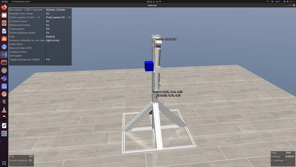
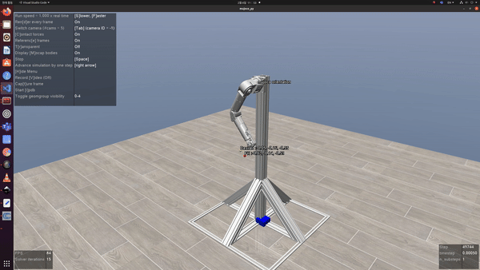

# Robotic Arm Simulation in MuJoCo Environment
 
This repository is about operating a robotic arm in the MuJoCo environment. It includes code for the following functionalities:
 
- Loading and simulating a 7-dof robotic arm's MJCF model in the MuJoCo environment.
- Saving the data obtained from the simulation into csv files.
 
#### Collision



#### Free Motion




## How to Use
 
```bash
$ python collision.py
```

## Software Requirement


## Repository Content
The core of this repository consists of the following two scripts:

- collision.py
    - Generates random collisions on the robotic arm by randomly placing cubes within a certain area.
    - Records on which link and at what time-step a collision occurred.
        - If a collision occurred at link n at time t, then row t of fre_joint_{n}.csv will be marked as 1.
    - Loads desired points from a csv file and moves the robot to those positions using inverse kinematics.
    - The robot is moved using PID control.
    - Records joint position (q) information for each joint in a csv file, time-step by time-step.
- free_motion.py
    - Similar to collision.py, except it does not include generating cubes.

The structure of the generated files is as follows:

```bash
    |--collision/
        |--fre_joint_1.csv
        |--fre_joint_2.csv
        |--fre_joint_3.csv
        |--fre_joint_4.csv
        |--fre_joint_5.csv
        |--fre_joint_6.csv
        |--fre_joint_7.csv
    |--input_data/
        |--joint_position
            |--fre_joint_1.csv
            |--fre_joint_2.csv
            |--fre_joint_3.csv
            |--fre_joint_4.csv
            |--fre_joint_5.csv
            |--fre_joint_6.csv
            |--fre_joint_7.csv
    |--target_data/
        |--fre_joint_1.csv
        |--fre_joint_2.csv
        |--fre_joint_3.csv
        |--fre_joint_4.csv
        |--fre_joint_5.csv
        |--fre_joint_6.csv
        |--fre_joint_7.csv
```

## File Contents

```bash
|--model/
    |--KINOVA/
    |--ROBROS/
	|--arenas/
    |--robot/
        |--.stl
        |--base.xml
        |--mjmodel.xml
        |--model.urdf
	|--textures/
|--dataset_generator/
	|--script/
        |--gravity/
            |--utils/
                |--__init__.py
                |--compute.py # use this
            |--collision.py 
            |--free_motion.py
        |--no_gravity/
        |--visualization/
            |--visualize.ipynb
|--visualize_workspace/
    |--utils/
        |--plot.ipynb
    |--viz_all.py
    |--viz.py
```


